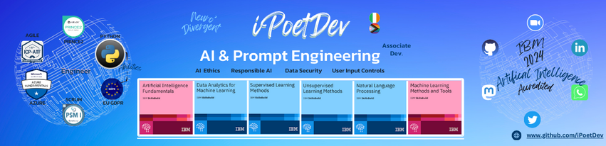

<!--
    **iPoetDev/Ipoetdev** is a ✨ _special_ ✨ repository because its `README.md` (this file) appears on your GitHub profile.
-->

      )

## Focus

- **Interests**: AI | Prompt Engineering | Developers Experiences, Tools  |  DevOps & Systems  |  Platforms  | Infrastructure  | ITOps | Scrum Master & Agile Facilitator | Software Process Design

> 

## Currently
<!--
- **October**: HacktoberFest '24.
>  - 1️⃣ *Project*:
>     - URL:
>     - Promote: 
 
-->

| - **December**: Own Projects. | -- | **Recent** Open Source | 
| --- | --- | -- | 
| - 1️⃣ *Project*: [https://github.com/iPoetDev/PSProfileTUI](https://github.com/iPoetDev/PSProfileTUI). | -- |  [Hacktober '24 Contributor, Roadmap.sh](https://github.com/iPoetDev/roadmap-sh--developer-roadmap)  | 
| - 2️⃣ *Project*: [https://github.com/iPoetDev/DevSandbox-Win](https://github.com/iPoetDev/DevSandbox-Win) | -- | [Prompt Engineering, Content, Roadmap.sh](https://roadmap.sh/prompt-engineering) | 

> 

> 

## Portfolio

- 🔗  
    - [-blue?logo=credly&labelColor=195a50&color=ffc844&style=plastic)](https://www.credly.com/badges/209dcbfb-44e1-473f-a9b0-c2aa81e9024f "Credly.com: Fundamentals in Artificial Intelligence: issued by IBM")
    - [-blue?logo=credly&labelColor=195a50&color=ffc844&style=plastic)](https://www.credly.com/badges/e079ab4e-3e1e-42ae-8cd7-571a4291ccca "Credly.com: Machine Learning Methods and Tools: issued by IBM")
    - [-blue?logo=credly&labelColor=195a50&color=ffc844&style=plastic)](https://www.credly.com/badges/c38b18d3-406d-44a6-9648-e922a4085c53 "Credly.com: Data Analytics for Machine Learning: issued by IBM")
    - [-blue?logo=credly&labelColor=195a50&color=ffc844&style=plastic)](https://www.credly.com/badges/5390c697-b21e-4813-8c11-60004ba3dee7 "Credly.com: Supervised Learning Method: issued by IBM")
    - [-blue?logo=credly&labelColor=195a50&color=ffc844&style=plastic)](https://www.credly.com/badges/df3eea7c-8d36-47c2-aa1d-0b0ecde290be "Credly.com: Unsupervised Learning Methods: issued by IBM")
    - [-blue?logo=credly&labelColor=195a50&color=ffc844&style=plastic)](https://www.credly.com/badges/ea8ed0c0-afd7-42ee-a92b-46adc7fceb09 "Credly.com: Natural Language Processing: issued by IBM")

###  Roadmap.sh

>  contains community-curated roadmaps, study plans, paths, and resources for developers. There are role-based roadmaps, listing skills for any given role, as well as skill-based roadmaps for improving. The following are continually self assessed.

<small>**`Roadmap/Domain Area (Done/No of Topics per Roadmap)`**</small>

#### DevOps, SRE, Systems etc

- [-a753f7?logo=roadmaps&labelColor=0e1628)](https://roadmap.sh/python?s=65b190180c5481228332b827)
- [-a753f7?logo=roadmaps&labelColor=0e1628)](https://roadmap.sh/devops?s=65b190180c5481228332b827)
- [-a753f7?logo=roadmaps&labelColor=0e1628)](https://roadmap.sh/linux?s=65b190180c5481228332b827)
- [-a753f7?logo=roadmaps&labelColor=0e1628)](https://roadmap.sh/git-github?s=65b190180c5481228332b827)
- [-a753f7?logo=roadmaps&labelColor=0e1628)](https://roadmap.sh/git-github?s=65b190180c5481228332b827)

#### Data, AI & ML

- [-a753f7?logo=roadmaps&labelColor=0e1628)](https://roadmap.sh/postgresql-dba?s=65b190180c5481228332b827)
- [-a753f7?logo=roadmaps&labelColor=0e1628)](https://roadmap.sh/sql?s=65b190180c5481228332b827)
- [-a753f7?logo=roadmaps&labelColor=0e1628)](https://roadmap.sh/ai-data-scientist?s=65b190180c5481228332b827)
- [-a753f7?logo=roadmaps&labelColor=0e1628)](https://roadmap.sh/data-analyst?s=65b190180c5481228332b827)
- [-a753f7?logo=roadmaps&labelColor=0e1628)](https://roadmap.sh/prompt-engineering?s=65b190180c5481228332b8277)
- [-a753f7?logo=roadmaps&labelColor=0e1628)](https://roadmap.sh/prompt-engineering?s=65b190180c5481228332b8277)

#### Security, Software Architecture etc

- [-a753f7?logo=roadmaps&labelColor=0e1628)](https://roadmap.sh/cyber-security?s=65b190180c5481228332b827)
- [-a753f7?logo=roadmaps&labelColor=0e1628)](https://roadmap.sh/software-design-architecture?s=65b190180c5481228332b827)
- [-a753f7?logo=roadmaps&labelColor=0e1628)](https://roadmap.sh/software-design-architecture?s=65b190180c5481228332b827)
- [-a753f7?logo=roadmaps&labelColor=0e1628)](https://roadmap.sh/software-architect?s=65b190180c5481228332b827)
- [-a753f7?logo=roadmaps&labelColor=0e1628)](https://roadmap.sh/computer-science?s=65b190180c5481228332b827)

##### Writing, Docs & Collaboration

- [-a753f7?logo=roadmaps&labelColor=0e1628)](https://roadmap.sh/technical-writer?s=65b190180c5481228332b827)

#### Web Dev & Design

- [-a753f7?logo=roadmaps&labelColor=0e1628)](https://roadmap.sh/javascript?s=65b190180c5481228332b827)
- [-a753f7?logo=roadmaps&labelColor=0e1628)](https://roadmap.sh/nodejs?s=65b190180c5481228332b827)
- [-a753f7?logo=roadmaps&labelColor=0e1628)](https://roadmap.sh/frontend?s=65b190180c5481228332b827)
- [-a753f7?logo=roadmaps&labelColor=0e1628)](https://roadmap.sh/backend?s=65b190180c5481228332b827)
- [-a753f7?logo=roadmaps&labelColor=0e1628)](https://roadmap.sh/full-stack?s=65b190180c5481228332b827)

**Visit**: - 

### Workflows & Methods

- 💬 Ask me about what I am ...
- 🌱 I am currently employing ...
    - Workflow development i.e. Process & Flows
    - Project management i.e. Agile Boards, Kanban, Scrum
    - Agile & Scrum artefacts i.e. Epics, Features, Stories, User Acceptance
    - Test Strategies & Test Case Management i.e. Test Driven Development & Unit Testing
    - Configuration & Security: i.e. Infra, Settings & Secrets Management.
    - Deploy & Release: i.e. Cloud Hosting & App Publishing

### Contact

-  |  | 
- 😄 Pronouns: he/him/his/hij/il
- ⚡ Fun fact: I climbed My Kenya, and I represented my country in sport, and I used to Dive

<!--

Here are some ideas to get you started:

- 🔭 I’m currently working on ...
- 🌱 I’m currently learning ...
- 🤔 I’m looking for help with ...
- 💬 Ask me about ...
- ⚡ Fun fact: ...
-->

 

> 

> <b>STATS</b>: Activity
> 

<!--START_SECTION:waka-->
<!--END_SECTION:waka-->

WakaTime's Profile Readme Development Stats by  
